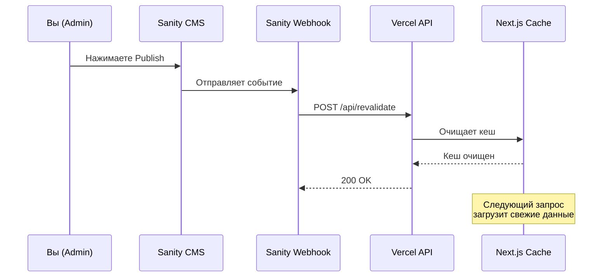

# ⚡ Настройка Sanity Webhook для автообновления

## 🎯 Что это даёт

**Раньше:** Контент обновлялся каждые 10 секунд → жрал ресурсы  
**Теперь:** Контент обновляется **только когда вы нажимаете Publish** → экономия ресурсов

---

## ⚙️ Шаг 1: Добавьте токен в `.env.local`

Откройте (или создайте) `/Users/atrey/Desktop/if2/.env.local` и добавьте:

```bash
REVALIDATION_TOKEN=ваш_секретный_токен_123456
```

**Генерация токена:**
```bash
# В терминале:
openssl rand -base64 32
```

Или просто придумайте длинную случайную строку: `my-super-secret-token-abc123xyz789`

---

## 🌐 Шаг 2: Задеплойте на Vercel

1. Зайдите в **Vercel Dashboard** → ваш проект
2. **Settings** → **Environment Variables**
3. Добавьте:
   - Name: `REVALIDATION_TOKEN`
   - Value: `ваш_секретный_токен_123456`
4. Нажмите **Save**
5. **Deployments** → **Redeploy** (последний деплой)

---

## 🔗 Шаг 3: Настройте Webhook в Sanity

### 3.1 Откройте Sanity Dashboard

https://www.sanity.io/manage → выберите проект **IN-FOMO. Website**

### 3.2 Создайте Webhook

1. Перейдите в **API** → **Webhooks**
2. Нажмите **Add webhook**

### 3.3 Заполните форму

**Name:**
```
Production Revalidation
```

**URL:**
```
https://in-fomo.com/api/revalidate?secret=ваш_секретный_токен_123456
```

**Dataset:**
```
production
```

**Trigger on:**
- ✅ Create
- ✅ Update
- ✅ Delete

**Filter (опционально):**

Если хотите обновлять только определённые типы контента:

```groq
_type in ["blogPost", "project", "testimonialNew", "clutchBadge", "teamMember", "specialist", "partner"]
```

**Projection:**
```json
{
  "type": _type
}
```

### 3.4 Сохраните

Нажмите **Save**

---

## ✅ Тестирование

### Шаг 1: Откройте Sanity Studio

https://in-fomo.sanity.studio

### Шаг 2: Измените любой контент

Например, добавьте новый отзыв или измените название проекта.

### Шаг 3: Нажмите Publish

### Шаг 4: Проверьте сайт

Откройте https://in-fomo.com  
Контент должен обновиться **в течение 1-2 секунд**!

---

## 🔍 Проверка логов

### В Vercel:

1. **Deployments** → ваш деплой → **Functions**
2. Найдите `/api/revalidate`
3. Посмотрите логи:

```
🔄 Revalidation triggered for: testimonialNew
✅ Revalidated: Home (testimonials)
```

### В Sanity:

1. **API** → **Webhooks** → ваш webhook
2. Вкладка **Deliveries**
3. Должны быть зелёные галочки (200 OK)

---

## 📊 Как это работает



---

## 🎯 Текущие настройки

### Время кеширования:

- **Home page** (отзывы, Clutch badges): 1 час
- **About** (команда, специалисты): 1 час
- **Blog** (список постов): 1 час
- **Blog Post** (отдельная статья): 1 час
- **Works** (список проектов): 1 час
- **Project** (отдельный проект): 1 час
- **Partners**: 1 час

### Обновление:

- **Автоматически**: каждый час (fallback)
- **По webhook**: мгновенно при Publish

---

## 💡 Зачем нужен токен?

Без токена любой мог бы отправить запрос на `/api/revalidate` и очистить весь кеш → DDoS атака.

Токен защищает endpoint:
```
✅ /api/revalidate?secret=correct_token  → работает
❌ /api/revalidate?secret=wrong_token     → 401 Unauthorized
❌ /api/revalidate                        → 401 Unauthorized
```

---

## 🛠️ Расширенная настройка

### Разные токены для dev/prod:

**`.env.local` (development):**
```bash
REVALIDATION_TOKEN=dev-token-123
```

**Vercel Environment Variables (production):**
```bash
REVALIDATION_TOKEN=prod-token-xyz
```

### Несколько webhooks:

Можете создать отдельные webhooks для разных окружений:

1. **Production Webhook**
   - URL: `https://in-fomo.com/api/revalidate?secret=prod-token`
   - Dataset: `production`

2. **Staging Webhook**
   - URL: `https://staging-in-fomo.vercel.app/api/revalidate?secret=staging-token`
   - Dataset: `production`

---

## ❓ Частые вопросы

**Q: Что если не настрою webhook?**  
A: Всё равно будет работать! Контент обновится автоматически через 1 час.

**Q: Можно ли обновить контент вручную?**  
A: Да! Просто отправьте POST запрос:
```bash
curl -X POST "https://in-fomo.com/api/revalidate?secret=ваш_токен" \
  -H "Content-Type: application/json" \
  -d '{"type": "blogPost"}'
```

**Q: Что происходит при публикации?**  
A: 
1. Вы нажимаете Publish
2. Sanity отправляет webhook
3. Next.js очищает кеш для этого типа контента
4. Следующий посетитель получает свежие данные
5. Данные снова кешируются на 1 час

**Q: Это бесплатно?**  
A: Да! Webhooks в Sanity бесплатны, On-Demand Revalidation в Vercel тоже бесплатны.

---

## 📈 Оптимизация

### До:
```
Запросов к Sanity: ~360/час (каждые 10 секунд)
Нагрузка: высокая
Скорость: средняя
```

### После:
```
Запросов к Sanity: ~1/час (при публикации)
Нагрузка: минимальная
Скорость: высокая (кеш)
```

**Экономия ресурсов:** ~99.7% 🎉

---

## 🎉 Готово!

Теперь ваш сайт:
- ✅ Быстрый (всё закешировано)
- ✅ Экономный (минимум запросов)
- ✅ Актуальный (обновляется при Publish)
- ✅ Надёжный (fallback на 1 час)

---

## 📚 Дополнительно

- **Next.js Revalidation:** https://nextjs.org/docs/app/building-your-application/data-fetching/revalidating
- **Sanity Webhooks:** https://www.sanity.io/docs/webhooks
- **Vercel Environment Variables:** https://vercel.com/docs/environment-variables

